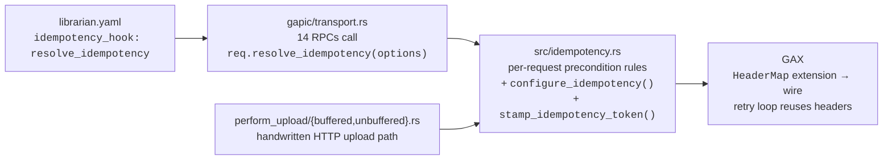
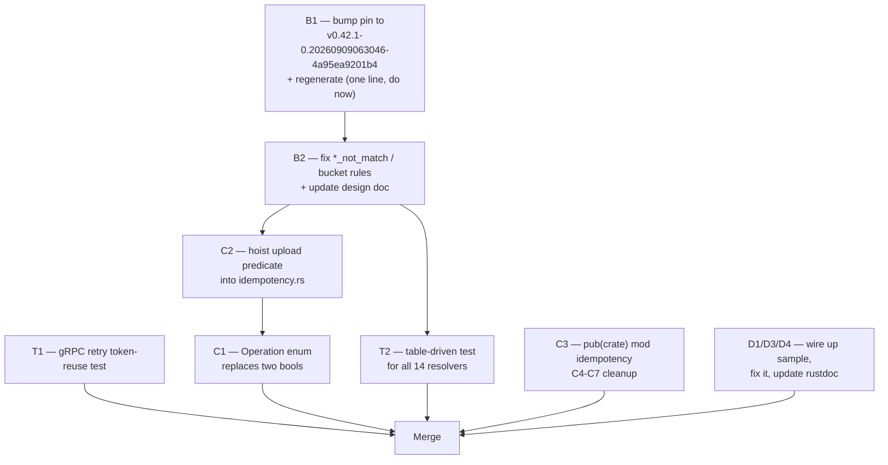

# Code Review — `feat/storage-idempotency`

**Repository:** `~/feature-parity-rust/write/google-cloud-rust`
**Branch:** `feat/storage-idempotency` (4 commits ahead of `upstream/main` @ `ecfc7c243`)
**Reviewed:** 2026-09-11
**Design doc:** [go/gcs-rust-sdk-idempotency-design](http://go/gcs-rust-sdk-idempotency-design) (`~/feature-parity-rust/gcs_rust_sdk_idempotency_design.md`)

---

## 1. Summary

> [!IMPORTANT]
> **Round 2 (2026-09-11, second pass).** All round-1 findings have been addressed in the working tree. The verdict below has been updated; §10 records the re-review and the eight remaining nits. Sections 2–9 are preserved as the round-1 record — treat every finding there as **resolved** unless §10 says otherwise.

| | |
| :--- | :--- |
| **Files changed** | 14 (5 commits + uncommitted fixes) |
| **Round-1 verdict** | ~~Request changes~~ — one correctness bug (`*_not_match` preconditions treated as idempotent) plus refactoring and docs. |
| **Round-2 verdict** | **Approve with nits.** No blockers remain. B1, B2, C1–C7, T1–T4, D1–D4 are all fixed, the design doc is updated, and the fix went beyond the review (a CI guard against silent hook loss). Eight minor items in §10 — none need to block merge. |
| **`cargo test -p google-cloud-storage`** | ✅ 978 passed, 0 failed (was 938) |
| **`cargo fmt --check`** | ✅ clean |
| **`cargo clippy` (default / strict / samples)** | ✅ all clean — see §7 |

### What the change does

Adds request-level idempotency resolution and `x-goog-gcs-idempotency-token` deduplication to the GCS Rust SDK, in three layers:



### Strengths

- **Right architectural call.** Putting the policy in `idempotency.rs` and reaching it through a generic, opt-in generator hook keeps `sidekick` service-agnostic. The rejected alternatives in the design doc (decorator, GCS logic in the generator) really are worse.
- **Token minted once per logical call, not per attempt.** Verified end-to-end: `resolve_idempotency` runs before `gaxi::grpc::Client::execute` ([grpc.rs:136-157](file:///usr/local/google/home/chensg/feature-parity-rust/write/google-cloud-rust/src/gax-internal/src/grpc.rs#L136-L157)), which materializes headers **once** at `:149` and clones them per attempt at `:463`. The handwritten upload path does the same explicitly (commit `4a14428`, hoisting `configure_idempotency` out of the retry loop). This is the subtlest part of the feature and it is correct.
- **Complete coverage of the generated surface.** All 14 `google.storage.v2.Storage` RPCs in [`gapic/stub.rs`](file:///usr/local/google/home/chensg/feature-parity-rust/write/google-cloud-rust/src/storage/src/generated/gapic/stub.rs#L42-L173) have a matching `resolve_idempotency` impl. No RPC was missed, and no stale `set_default_idempotency` remains in `gapic/transport.rs`.
- **Genuinely good tests for the hard cases.** `TokenCapture` inspecting real wire headers, token-identity-across-retries, `with_idempotency(false)` suppression, 412-not-retried, and the non-ASCII-header edge case are all high-value tests that a naive implementation would miss.

---

## 2. Blocker & generator pin

### B1 *(downgraded — no longer a blocker)* — Bump the stale generator pin to a pseudo-version

*Twice corrected after author feedback. (1) The hook landed upstream in [`4a95ea9`](https://github.com/googleapis/librarian/commit/4a95ea9201b45a0d90401b7a07ebe583c4ff1f98) (PR #7523, 2026-09-09) — it was never fork-only. (2) The pin does not have to be a release tag, so there is nothing to wait for.*

`librarian.yaml:1644` sets `idempotency_hook: resolve_idempotency`, but [`librarian.yaml:15`](file:///usr/local/google/home/chensg/feature-parity-rust/write/google-cloud-rust/librarian.yaml#L15) still pins `v0.42.0`, which was published `2026-09-08T17:35:15Z` — about 13 hours *before* the hook merged (`gh api compare/v0.42.0...4a95ea9` → `ahead_by: 5, behind_by: 0`). Regenerating on the current pin therefore still reverts the feature.

**The pin accepts any Go module version, not just a tag.** [`.gcb/format.yaml:127-132`](file:///usr/local/google/home/chensg/feature-parity-rust/write/google-cloud-rust/.gcb/format.yaml#L127-L132) reads the field verbatim and hands it to Go:

```bash
V=$(sed -n 's/^version: *//p' /workspace/librarian.yaml)
go install github.com/googleapis/librarian/cmd/librarian@${V}
```

And the repo has already done exactly this — [`00be565b9`](file:///usr/local/google/home/chensg/feature-parity-rust/write/google-cloud-rust/librarian.yaml) *"chore: update librarian version to v0.40.1-0.20260901220007-4f82678cd687"* (PR #6626) pinned an unreleased commit to pick up streaming fixes.

So this is a one-line change available today:

```diff
-version: v0.42.0
+version: v0.42.1-0.20260909063046-4a95ea9201b4
```

That pseudo-version is Go's canonical form for `4a95ea9`, confirmed with `go list -m github.com/googleapis/librarian@4a95ea9201b45a0d90401b7a07ebe583c4ff1f98`. Prefer it over the raw SHA: Go accepts `@<sha>` but rewrites it to this string anyway, so writing it explicitly keeps `librarian.yaml` immutable and reproducible, and matches the existing precedent. Swap it for `v0.43.0` whenever the next release lands.

After bumping, regenerate and confirm `gapic/transport.rs` comes back byte-identical — that also clears the stale `"Tonic-generated client"` doc comment in C7 for free.

> [!WARNING]
> Independently of the pin, the failure mode here deserves a CI guard, because it is **silent**. Config is parsed with a plain `yaml.Unmarshal` and no `KnownFields(true)` (`internal/yaml/yaml.go:48-54`), so an older generator does not reject the unknown `idempotency_hook` key — it ignores it, falls through to `set_default_idempotency(options, false)`, and rewrites all 14 `req.resolve_idempotency(options)` call sites. `idempotency.rs` keeps compiling as dead code and **CI stays green while the data-integrity protection is gone**. Assert that `gapic/transport.rs` has 14 `resolve_idempotency` call sites and zero `set_default_idempotency` ones.

Two scope notes that are unchanged by the upstream merge — the merged commit touches only `grpc-client/transport.rs.mustache`, so:

- The hook is wired only into the **unary** branch. The generic `crate/src/transport.rs.mustache` (HTTP/hybrid clients) still hardcodes `set_default_idempotency`, and the server-streaming/bidi branches emit no idempotency call at all. Fine for GCS today; worth knowing before another service adopts the hook.
- `gapic_control/transport.rs` still has 40 `set_default_idempotency` sites (all `storage.control.v2`, plus `GetIamPolicy`/`SetIamPolicy`/`TestIamPermissions` at `:2478/:2580/:2682`). This is a documented non-goal, but note that **IAM policy mutations on buckets route through this file**, so `SetIamPolicy` gets no token even though the official GCS table calls it conditionally idempotent on `etag`.


### B2 — `*_not_match` preconditions are treated as idempotent; retries can double-apply a mutation

Nine of the fourteen resolvers include `if_*_not_match` in the idempotency predicate, e.g. [`idempotency.rs:210-221`](file:///usr/local/google/home/chensg/feature-parity-rust/write/google-cloud-rust/src/storage/src/idempotency.rs#L210-L221):

```rust
impl crate::model::UpdateObjectRequest {
    pub(crate) fn resolve_idempotency(&self, options: RequestOptions) -> RequestOptions {
        let is_idempotent = self.if_generation_match.is_some()
            || self.if_generation_not_match.is_some()      // ← unsafe
            || self.if_metageneration_match.is_some()
            || self.if_metageneration_not_match.is_some(); // ← unsafe
        configure_idempotency(options, is_idempotent, true)
    }
}
```

A `*_match` precondition is what makes a mutation at-most-once: after the first attempt succeeds, the generation/metageneration moves, so the retry fails closed with `412`. A `*_not_match` precondition gives **no such guarantee** — it stays satisfied after a successful write, so the retry applies the mutation a second time. Concretely: `update_object().set_if_metageneration_not_match(5)` succeeds, bumps metageneration to `6`, the client sees a transient `503` on the response path, retries, and `6 != 5` still holds — the patch is applied twice.

This contradicts both the [official GCS retry strategy table](https://cloud.google.com/storage/docs/retry-strategy#idempotency-operations) and every other SDK:

| Operation | Official GCS docs | Go SDK | This change |
| :--- | :--- | :--- | :--- |
| `CreateBucket` | **Always** idempotent | `makeStorageOpts(true, …)` — [bucket.go:88](file:///usr/local/google/home/chensg/feature-parity-rust/read/google-cloud-go/storage/bucket.go#L88) | ❌ always `false` |
| `DeleteBucket` | **Always** idempotent | `makeStorageOpts(true, …)` — [bucket.go:101](file:///usr/local/google/home/chensg/feature-parity-rust/read/google-cloud-go/storage/bucket.go#L101) | ❌ conditional on metageneration |
| `LockBucketRetentionPolicy` | **Always** idempotent | `makeStorageOpts(true, …)` — [bucket.go:1517](file:///usr/local/google/home/chensg/feature-parity-rust/read/google-cloud-go/storage/bucket.go#L1517) | ⚠️ `if_metageneration_match > 0` |
| `UpdateBucket` | `IfMetagenerationMatch` or `etag` | `conds.MetagenerationMatch != 0` — [bucket.go:170](file:///usr/local/google/home/chensg/feature-parity-rust/read/google-cloud-go/storage/bucket.go#L170) | ❌ `+ not_match` |
| `UpdateObject` | `IfMetagenerationMatch` or `etag` | `conds.MetagenerationMatch != 0` — [storage.go:1089](file:///usr/local/google/home/chensg/feature-parity-rust/read/google-cloud-go/storage/storage.go#L1089) | ❌ `+ generation_match + not_match` |
| `DeleteObject` | `ifGenerationMatch` or a generation | `GenerationMatch != 0 \|\| gen >= 0` — [storage.go:1168](file:///usr/local/google/home/chensg/feature-parity-rust/read/google-cloud-go/storage/storage.go#L1168) | ❌ `+ not_match` |
| `ComposeObject` | `ifGenerationMatch` | dst `GenerationMatch != 0 \|\| DoesNotExist` — [copy.go:233](file:///usr/local/google/home/chensg/feature-parity-rust/read/google-cloud-go/storage/copy.go#L233) | ✅ correct |
| `RewriteObject` / `MoveObject` | `ifGenerationMatch` (destination) | dst only — [copy.go:123](file:///usr/local/google/home/chensg/feature-parity-rust/read/google-cloud-go/storage/copy.go#L123) | ❌ `+ not_match`, `+ source-only` |
| Uploads (`WriteObject`) | `ifGenerationMatch` | `GenerationMatch >= 0 \|\| DoesNotExist` — [writer.go:463](file:///usr/local/google/home/chensg/feature-parity-rust/read/google-cloud-go/storage/writer.go#L463) | ⚠️ `+ metageneration + not_match` |

> [!WARNING]
> This is a **data-integrity** bug in exactly the scenario the feature exists to prevent (OMG/90834). The design doc has the same error at lines 133-136, so the doc needs the same fix and probably a re-ping to reviewers.

**Recommended predicate:**

```rust
// Objects: writes/deletes are at-most-once only with a generation match.
let is_idempotent = self.if_generation_match.is_some() || self.generation > 0;
// Metadata patches: at-most-once only with a metageneration match.
let is_idempotent = self.if_metageneration_match.is_some();
// Buckets: create / delete / lock-retention are unconditionally idempotent.
configure_idempotency(options, true, true)
```

Two secondary points in the same table:

- **Source-only preconditions on `MoveObject`/`RewriteObject`.** Go deliberately looks at destination conditions only. `set_if_source_generation_match(...)` alone does not protect the *destination* from being written twice. Recommend dropping source conditions from the predicate, or documenting why GCS makes it safe.
- **`LockBucketRetentionPolicy`'s `if_metageneration_match > 0`.** The field is a **required** non-optional `i64` ([`model.rs:690-692`](file:///usr/local/google/home/chensg/feature-parity-rust/write/google-cloud-rust/src/storage/src/generated/gapic/model.rs#L690-L692), *"Must be positive"*). The `> 0` check therefore only fires for already-invalid requests. Simplify to `configure_idempotency(options, true, true)` — it also removes the only `> 0` special case from the file.

---

## 3. Rust practice & code cleanliness

### C1 — Two adjacent `bool` parameters; replace with an enum *(medium)*

[`configure_idempotency(options, is_idempotent, is_mutating)`](file:///usr/local/google/home/chensg/feature-parity-rust/write/google-cloud-rust/src/storage/src/idempotency.rs#L78-L86) is the classic boolean-blindness smell, and the change works around it with C-style argument comments:

```rust
let options = crate::idempotency::configure_idempotency(
    self.options.gax(),
    is_idempotent,
    /*is_mutating=*/ true,
);
```

`/*name=*/` appears **nowhere else in `src/`** — it is a C++ idiom, not a Rust one. It also produces the awkward rustfmt output in the unit tests:

```rust
let resolved = configure_idempotency(
    options, true, // is_idempotent
    true, // is_mutating
);
```

Also note `is_mutating` is fully determined by the operation kind — it is exactly `!is_read`, and every call site passes a literal. Collapse both booleans:

```rust
pub(crate) enum Operation {
    /// Reads and lists: always retryable, never carry a dedup token.
    Read,
    /// Mutations: retryable only when `idempotent`, and then carry a token.
    Mutation { idempotent: bool },
}

pub(crate) fn configure_idempotency(options: RequestOptions, op: Operation) -> RequestOptions;
```

Call sites become self-documenting (`configure_idempotency(options, Operation::Read)`), the comments disappear, and the illegal state `(is_idempotent: true, is_mutating: false)` combined with a caller override becomes unrepresentable.

### C2 — The same precondition predicate is copy-pasted three times in the upload path *(medium)*

Identical eight-line blocks in [`buffered.rs:60-63`](file:///usr/local/google/home/chensg/feature-parity-rust/write/google-cloud-rust/src/storage/src/storage/perform_upload/buffered.rs#L60-L63), [`unbuffered.rs:53-56`](file:///usr/local/google/home/chensg/feature-parity-rust/write/google-cloud-rust/src/storage/src/storage/perform_upload/unbuffered.rs#L53-L56), and [`unbuffered.rs:150-153`](file:///usr/local/google/home/chensg/feature-parity-rust/write/google-cloud-rust/src/storage/src/storage/perform_upload/unbuffered.rs#L150-L153). This also scatters the policy across three files instead of keeping it in `idempotency.rs`, which is what makes B2 easy to get wrong in one place and right in another. `PerformUpload::spec` is a `crate::model::WriteObjectSpec`, so add the rule next to its siblings:

```rust
// in idempotency.rs, alongside the other request evaluations
impl crate::model::WriteObjectSpec {
    pub(crate) fn is_idempotent(&self) -> bool {
        self.if_generation_match.is_some()
    }
}
```

and reduce each call site to one line:

```rust
let options = crate::idempotency::configure_idempotency(
    self.options.gax(),
    Operation::Mutation { idempotent: self.spec.is_idempotent() },
);
```

### C3 — `pub mod idempotency;` exposes an empty public module *(medium, API surface)*

[`lib.rs:62`](file:///usr/local/google/home/chensg/feature-parity-rust/write/google-cloud-rust/src/storage/src/lib.rs#L62) declares the module `pub`, but **every item inside is `pub(crate)`**. Every other `pub mod` in `lib.rs` (`backoff_policy`, `object_descriptor`, `read_object`, `read_resume_policy`, `retry_policy`, `signed_url`) exports real public types. This one renders on docs.rs as an empty module and implies a public API commitment the crate does not intend.

```diff
-pub mod idempotency;
+pub(crate) mod idempotency;
```

### C4 — `impl Default for IdempotencyToken` generates a random UUID *(low)*

[`idempotency.rs:31-35`](file:///usr/local/google/home/chensg/feature-parity-rust/write/google-cloud-rust/src/storage/src/idempotency.rs#L31-L35). A `Default` that is neither cheap nor deterministic is surprising, and it exists only to enable `.unwrap_or_default()` at `:60`. Drop the impl and use `.unwrap_or_else(IdempotencyToken::new)` — same length, no surprising trait.

### C5 — `stamp_idempotency_token` rewrites the header unconditionally and leans on a misleading `expect` *(low)*

[`idempotency.rs:56-70`](file:///usr/local/google/home/chensg/feature-parity-rust/write/google-cloud-rust/src/storage/src/idempotency.rs#L56-L70):

```rust
let token = headers.get(IDEMPOTENCY_TOKEN_HEADER)
    .and_then(|value| value.to_str().ok())
    .map(|value| IdempotencyToken(value.to_string()))
    .unwrap_or_default();
headers.insert(
    HeaderName::from_static(IDEMPOTENCY_TOKEN_HEADER),
    HeaderValue::from_str(&token.0).expect("valid UUID header"),
);
```

The `expect` is in fact unreachable (`to_str()` only succeeds for visible ASCII, which `from_str` always accepts), but the message says *"valid UUID header"* when the value may well be a caller-supplied non-UUID — a future reader cannot tell whether the invariant is real. Restructure so the `expect` only guards a freshly-minted UUID, and skip the round-trip when the header is already usable:

```rust
match headers.get(IDEMPOTENCY_TOKEN_HEADER).and_then(|v| v.to_str().ok()) {
    // Adopt a caller-supplied token; the header is already on the wire.
    Some(existing) => options.insert_extension(IdempotencyToken(existing.to_string())),
    None => {
        let token = IdempotencyToken::new();
        let value = HeaderValue::from_str(&token.0).expect("UUID v4 is a valid header value");
        headers.insert(HeaderName::from_static(IDEMPOTENCY_TOKEN_HEADER), value);
        options.insert_extension(headers).insert_extension(token)
    }
}
```

Separately: **adopting a caller-supplied token is an undocumented public behaviour.** Combined with the customer-headers feature, `with_custom_header("x-goog-gcs-idempotency-token", ...)` now silently becomes the deduplication key, with no validation. Either document it as a supported escape hatch or ignore caller values and always mint.

### C6 — Non-idiomatic comment style in `idempotency.rs` *(low)*

- The ASCII banner at [`:88-90`](file:///usr/local/google/home/chensg/feature-parity-rust/write/google-cloud-rust/src/storage/src/idempotency.rs#L88-L90) (`// ------…`) appears in only one other file in the whole repo. Drop it.
- The `// 1. Read / List Operations:` / `// 2. Unconditioned Mutating` / `// 3. Conditional Mutating` numbering restates the code. If the grouping is worth keeping, a single sentence of *why* (linking the GCS retry-strategy table) is more useful than three numbered labels.
- Conversely, the comments that **do** explain non-obvious reasoning — [`:62-64`](file:///usr/local/google/home/chensg/feature-parity-rust/write/google-cloud-rust/src/storage/src/idempotency.rs#L62-L64) on unconditional header write, and the "stamp once, outside the retry loop" comments in the upload path — are excellent. Keep those.

### C7 — Minor nits

| Location | Nit |
| :--- | :--- |
| [`token_capture.rs:34`](file:///usr/local/google/home/chensg/feature-parity-rust/write/google-cloud-rust/src/storage/src/storage/perform_upload/token_capture.rs#L34) | `call_count: AtomicUsize` in a struct whose `respond` takes `&mut self` — a plain `usize` suffices. |
| [`token_capture.rs:35-36`](file:///usr/local/google/home/chensg/feature-parity-rust/write/google-cloud-rust/src/storage/src/storage/perform_upload/token_capture.rs#L35-L36) | `success_headers: Vec<(&'static str, String)>` is over-general for two constructors; an `enum Success { Session(String), Json(Bytes) }` is clearer. |
| [`idempotency.rs`](file:///usr/local/google/home/chensg/feature-parity-rust/write/google-cloud-rust/src/storage/src/idempotency.rs#L262-L332) tests | Mixed naming in one module: `test_configure_idempotency_*` vs `idempotency_token_extension_matches_header`. Pick one (the repo trends toward no `test_` prefix). |
| `idempotency.rs` (2025) vs `examples/objects/idempotency.rs` + `tests/grpc_mock_idempotency.rs` (2026) | Inconsistent copyright years across files added in the same change. |
| [`transport.rs:37`](file:///usr/local/google/home/chensg/feature-parity-rust/write/google-cloud-rust/src/storage/src/generated/gapic/transport.rs#L37) | `"using a Tonic-generated client"` is the only such phrasing in the repo; every other generated transport and the generator template say `"using a gRPC client"`. Stale hand-edit — revert it to keep the generated diff clean (see B1). |

---

## 4. Tests

Coverage of the new logic is **good and well-proportioned** — the tests target behaviour on the wire rather than restating the implementation, and there is no obvious over-testing.

| Area | Tests | Assessment |
| :--- | :--- | :--- |
| Pure resolution logic | 9 in `idempotency.rs` | ✅ Covers precedence, override both ways, token reuse, custom header adoption, non-ASCII header, other-header preservation. |
| gRPC wire behaviour | 4 in `tests/grpc_mock_idempotency.rs` | ✅ Token present with `generation` / `if_generation_match`, absent when unconditioned, absent on reads. |
| Single-shot upload (HTTP) | 4 in `single_shot_tests.rs` | ✅ Token reuse across retry, no-token + no-retry, 412 not retried, `with_idempotency(false)`. |
| Resumable upload (HTTP) | 3 across `{,un}buffered/resumable_tests.rs` | ✅ Token reuse, unconditioned still retries, override suppresses token. |

### T1 — The single most important claim is untested: token reuse across a **gRPC** retry *(high)*

The design's central assertion (doc line 275) is that GAX preserves the identical token across gRPC retry attempts. Every gRPC test uses `mock.expect_delete_object().return_once(...)` and never simulates a transient failure — so the reuse path is only covered on the HTTP upload path, which uses a *different* transport (`gax-internal/src/http.rs`) than the one the feature is actually built for.

Add one test: have the mock return `UNAVAILABLE` on the first call and `Ok` on the second, collect both tokens, assert they are equal and non-empty. This is the regression test that protects against someone later moving `resolve_idempotency` inside the retry loop.

### T2 — Five resolvers have no test *(medium)*

[`test_request_idempotency_evaluations`](file:///usr/local/google/home/chensg/feature-parity-rust/write/google-cloud-rust/src/storage/src/idempotency.rs#L334-L428) covers Get/List ×4, `CreateBucket`, `DeleteObject`, `DeleteBucket`, `MoveObject`, `LockBucketRetentionPolicy`. Untested: **`ComposeObject`, `RewriteObject`, `RestoreObject`, `UpdateObject`, `UpdateBucket`** — and `RewriteObject` has the most complex predicate in the file (8 clauses). Rather than adding five more `assert!` blocks to an already-100-line test, convert it to a table:

```rust
#[test_case(GetObjectRequest::default(), true; "reads are always idempotent")]
#[test_case(DeleteObjectRequest { generation: 12345, ..Default::default() }, true; "delete by generation")]
#[test_case(UpdateObjectRequest { if_metageneration_not_match: Some(5), ..Default::default() }, false; "not_match is not at-most-once")]
```

The crate already uses `test_case` elsewhere. This shrinks the test while covering all 14, and gives B2 a place to live as an explicit regression.

### T3 — Two smaller gaps

- **Token uniqueness across distinct requests** is an explicit item in the design's test plan (§Test Plan, "uniqueness across generated tokens") and is not covered. One assertion that two independent `configure_idempotency` calls yield different tokens closes it.
- **The resumable data `PUT`s carry no token** — [`buffered.rs:131-138`](file:///usr/local/google/home/chensg/feature-parity-rust/write/google-cloud-rust/src/storage/src/storage/perform_upload/buffered.rs#L131-L138) and [`unbuffered.rs:134-141`](file:///usr/local/google/home/chensg/feature-parity-rust/write/google-cloud-rust/src/storage/src/storage/perform_upload/unbuffered.rs#L134-L141) rebuild `options` from `self.options.gax()`, discarding the token-bearing options. This matches the design (only session creation is stamped; the session URL is the dedup key thereafter), but it is load-bearing and invisible. Assert it in the existing resumable tests so a future refactor cannot change it silently.

### T4 — Duplication between the two resumable tests *(low)*

`buffered_resumable_retry_token_reuse` and `resumable_retry_token_reuse` are ~50 near-identical lines each. A shared helper taking a `send` closure would halve them.

---

## 5. Design conformance

| Design element | Status |
| :--- | :--- |
| Generator hook `idempotency_hook` | ✅ Merged upstream (PR #7523); pin bump is a one-line change — see B1 |
| Per-request `resolve_idempotency` on 14 model types | ✅ Complete |
| `configure_idempotency` / `stamp_idempotency_token` helpers | ✅ Implemented; token stamping improved over the doc (extension and wire header always agree, doc §D would have let them diverge) |
| Precedence: `.with_idempotency()` > automatic | ✅ Implemented and tested |
| Reads idempotent, no token | ✅ |
| Unconditioned mutations non-idempotent | ✅ |
| Handwritten upload integration | ✅ Improved over the doc — the doc's `start_resumable_upload_attempt` (§C.2) resolves idempotency *inside* the attempt, which would mint a fresh token per retry. Commit `4a14428` correctly hoists it out. **Update the doc to match.** |
| Precondition rules | ❌ **Doc and code both wrong on `*_not_match`** — see B2 |
| Documentation plan (examples) | ⚠️ Sample added but never executed — see §6 |
| Public docs for `with_idempotency` | ❌ Not updated — see §6 |

---

## 6. Documentation & examples

### D1 — The new sample is never run *(medium)*

[`examples/src/objects/idempotency.rs`](file:///usr/local/google/home/chensg/feature-parity-rust/write/google-cloud-rust/src/storage/examples/src/objects/idempotency.rs) defines `sample(...)`, but **nothing calls it**. Every other sample is invoked from the driver in [`examples/src/lib.rs`](file:///usr/local/google/home/chensg/feature-parity-rust/write/google-cloud-rust/src/storage/examples/src/lib.rs#L372-L644) (e.g. `objects::move_file::sample(&control, &id, &id).await?;` at `:476`); the `#[allow(dead_code)]` added at [`objects.rs:40`](file:///usr/local/google/home/chensg/feature-parity-rust/write/google-cloud-rust/src/storage/examples/src/objects.rs#L40) is what suppresses the resulting warning. The sample therefore compiles but is never exercised against a real bucket — it could be wrong and CI would not notice. Wire it into `lib.rs` next to the other object samples.

### D2 — Module declaration is out of alphabetical order *(trivial)*

[`objects.rs:41`](file:///usr/local/google/home/chensg/feature-parity-rust/write/google-cloud-rust/src/storage/examples/src/objects.rs#L41) puts `idempotency` between `list_object_contexts` and `make_public`. It belongs between `get_object_contexts` and `list_file_archived_generations`.

### D3 — The sample's step 2 demonstrates a no-op *(medium)*

```rust
// Setting `with_idempotency(false)` disables retries even if preconditions are present.
let updated = client
    .write_object(&bucket, object_name, updated_data)
    .set_if_generation_match(created.generation)
    .with_idempotency(true) // Explicit override
```

The comment explains `false` while the code passes `true` — and on a request that already has `if_generation_match`, `with_idempotency(true)` changes nothing. The override is only meaningful on an **unconditioned** mutation. Either demonstrate that case (with the caveat that the GCS docs call it an anti-pattern) or demonstrate `with_idempotency(false)`, and make the comment match the code.

### D4 — `with_idempotency`'s rustdoc is now stale *(medium)*

[`write_object.rs:628-629`](file:///usr/local/google/home/chensg/feature-parity-rust/write/google-cloud-rust/src/storage/src/storage/write_object.rs#L628-L629) still says:

> The client library treats resumable uploads as idempotent, regardless of the value in this option.

That is no longer the whole truth: `with_idempotency(false)` now **suppresses the deduplication token** on resumable session creation — which the change's own test `buffered_resumable_idempotency_override_false_omits_token` asserts. Since this is user-visible behaviour on a public method, the rustdoc must be updated. It is also worth documenting what the token is and when it is sent, given `idempotency` is (currently) a public module with no public docs.

### D5 — Header scope: gRPC vs JSON *(question for the backend team)*

The design's observability table scopes `x-goog-gcs-idempotency-token` to *"Storage service gRPC (`google.storage.v2`)"*, but the handwritten upload path stamps it on **JSON/HTTP** requests to `/upload/storage/v1/b/{bucket}/o`. Please confirm the JSON API front end honours the header for deduplication; if it does, update the design doc's scope, and if it does not, the upload-path stamping is inert (harmless, but the retry-safety claim for uploads then rests on preconditions alone).

---

## 7. Build, lint & format

*Round-1 snapshot. Round 2 re-ran all five checks — still green, now **978 passed** (616 lib). See §10.1.*

| Check | Result |
| :--- | :--- |
| `cargo fmt --check -p google-cloud-storage` | ✅ clean |
| `cargo test -p google-cloud-storage` | ✅ **938 passed, 0 failed** (577 lib + 258 doc + 103 integration) |
| `cargo clippy -p google-cloud-storage --all-targets -- -D warnings` | ✅ clean |
| `cargo clippy --all-features --no-deps -p google-cloud-storage -- -D missing_docs -D clippy::exhaustive_enums` (repo `clippy-strict`) | ✅ clean |
| `cargo clippy -p storage-samples --all-targets -- -D warnings` | ✅ clean |

Note that the strict `-D missing_docs` check passes only because `idempotency.rs` carries a module-level doc and has no public items — it will start failing the moment anything in that module is made `pub`, which is another reason to apply **C3**.


> [!NOTE]
> Running `cargo test` inside the agent sandbox produces 101 spurious failures with `Direct IP access is not allowed` — the sandbox proxy blocks the loopback `httptest` servers. All tests pass when run outside the sandbox. Worth knowing before anyone debugs a phantom failure.

---

## 8. Recommended order of work



1. **B1 first, not last** — it is one line plus a regeneration, and doing it up front proves the hook works end-to-end against a real generator instead of a hand-edited `transport.rs`. It also clears C7's stale doc comment.
2. **B2** — the correctness fix, and it changes the shape of the code that C1/C2 refactor.
3. **C2 → C1** — collapse the triplication, then remove boolean blindness. After B2, so the same bug is not fixed in three places.
4. **T1, T2** — lock in the corrected rules and the reuse guarantee.
5. **C3, C4-C7, D1-D4** — cleanup and docs.

Add the CI guard from B1 at any point; it is cheap and the failure it catches is silent.

---

## 9. Nice work

Worth calling out explicitly, because it is the part that is easy to get wrong and this change got right:

- Hoisting `configure_idempotency` out of the retry loop in commit `4a14428` — the design doc itself had it inside the per-attempt function, which would have minted a new token on every retry and defeated the entire feature. Catching that during implementation is the difference between a working feature and one that only looks correct.
- `idempotency_token_extension_matches_header` — testing that the extension and the bytes actually on the wire agree, including the opaque non-ASCII header case, is the kind of test that only gets written by someone who thought carefully about the failure mode.
- Choosing the generic opt-in generator hook over a handwritten decorator. The alternatives section makes the case well, and it is the right long-term call for the other crates.

---

## 10. Round 2 — re-review of the follow-up fixes (2026-09-11)

Re-reviewed the uncommitted working-tree changes against every round-1 finding. Everything is addressed, correctly, and in a couple of places the fix is better than what I suggested.

> [!WARNING]
> The fixes are **uncommitted** (`git status` shows 14 modified files, `git log` still shows the same 5 commits). Commit them before pushing, conventional-commit style per the repo's `GEMINI.md`.

### 10.1 Round-1 findings — all resolved

| # | Resolution |
| :--- | :--- |
| **B1** | [`librarian.yaml:15`](file:///usr/local/google/home/chensg/feature-parity-rust/write/google-cloud-rust/librarian.yaml#L15) → `v0.42.1-0.20260909063046-4a95ea9201b4`, the pseudo-version for the hook commit. |
| **B2** | All 14 rules now match the [official retry table](https://cloud.google.com/storage/docs/retry-strategy#idempotency-operations) and the Go SDK line for line. `CreateBucket` / `DeleteBucket` / `LockBucketRetentionPolicy` → unconditional `true`; `UpdateBucket` / `UpdateObject` → `if_metageneration_match` only; `ComposeObject` / `RestoreObject` / `RewriteObject` / `MoveObject` → destination `if_generation_match` only; `DeleteObject` → `generation > 0 \|\| if_generation_match`. Every `*_not_match` check is gone. **This was the only blocker and it is fixed.** |
| **C1** | `Operation` enum (`Read` / `Mutation { idempotent }`) replaces the two-bool signature; the `/*is_mutating=*/` C-style comments are gone. |
| **C2** | [`WriteObjectSpec::is_idempotent()`](file:///usr/local/google/home/chensg/feature-parity-rust/write/google-cloud-rust/src/storage/src/idempotency.rs#L275-L279) is now the single source of truth for all three upload call sites. |
| **C3** | `pub(crate) mod idempotency`. |
| **C4** | `Default for IdempotencyToken` removed. |
| **C5** | Restructured to a `match`; `expect("UUID v4 is a valid header value")` now only guards a freshly-minted UUID, which genuinely cannot fail. |
| **C6** | ASCII banner replaced with a doc block that cites the retry-strategy URL and states the five rules. Much better than what I asked for. |
| **C7** | `AtomicUsize` → plain `usize`; `success_headers: Vec` → `enum Success { Session, Json }`; `test_` prefixes dropped; copyright years normalized; the stale `"Tonic-generated client"` doc comment reverted. |
| **T1** | `delete_object_retry_reuses_idempotency_token` in [`grpc_mock_idempotency.rs`](file:///usr/local/google/home/chensg/feature-parity-rust/write/google-cloud-rust/src/storage/tests/grpc_mock_idempotency.rs) — mock returns `UNAVAILABLE` then `Ok`, asserts both attempts carry the identical token. This closes the gap that mattered most. |
| **T2** | 38-case `#[test_case]` table covering all 14 resolvers plus `WriteObjectSpec` (see N1 for a readability nit). |
| **T3** | `tokens_are_unique_across_requests`, and the shared helper now asserts data PUTs carry **no** token via `not(request::headers(contains(key(…))))`. |
| **T4** | `assert_resumable_retry_token_reuse` in `token_capture.rs`; both resumable test modules call it. |
| **D1/D2** | Sample wired into [`examples/src/lib.rs:492`](file:///usr/local/google/home/chensg/feature-parity-rust/write/google-cloud-rust/src/storage/examples/src/lib.rs#L492), module moved to its alphabetical position, `#[allow(dead_code)]` removed. |
| **D3** | Sample step 2 now actually calls `with_idempotency(false)`, matching its comment. |
| **D4** | `with_idempotency` rustdoc rewritten; token suppression and resumable-session behavior are both documented. |
| **Design doc** | Updated — the `DeleteObjectRequest` example shows `generation > 0 \|\| if_generation_match.is_some()` and `Operation::Mutation`. The remaining `not_match` mentions are only in the API-surface setter list, which is correct. |
| **Bonus** | `gapic_transport_idempotency_hook_integrity` implements the CI guard I suggested in B1, via `include_str!`. Nice. |

**Verification** (run outside the sandbox):

```
cargo test   -p google-cloud-storage                                        → 978 passed, 0 failed
cargo fmt    --check -p google-cloud-storage                                → clean
cargo clippy -p google-cloud-storage --all-targets -- -D warnings           → clean
cargo clippy --all-features --no-deps -p google-cloud-storage \
             -- -D missing_docs -D clippy::exhaustive_enums                 → clean
cargo clippy -p storage-samples --all-targets -- -D warnings                → clean
```

### 10.2 New findings

None are blockers. N1 is the only one I would push on.

#### N1 *(medium — readability)* — the `#[test_case]` table is a tautology, at ~250 characters per line

[`idempotency.rs:456-496`](file:///usr/local/google/home/chensg/feature-parity-rust/write/google-cloud-rust/src/storage/src/idempotency.rs#L456-L496). Each attribute evaluates the assertion itself and passes a `bool`, so the body is `assert_eq!(actual, expected)` where `actual` is already the comparison result:

```rust
#[test_case(crate::model::GetObjectRequest::default().resolve_idempotency(google_cloud_gax::options::RequestOptions::default()).idempotent() == Some(true), true; "get_object: reads are always idempotent")]
```

Three problems: it reads as a double negative for the `false` rows; a failure prints `assertion failed: false == true` plus a case name and nothing else; and at that line length nobody can review the table by eye — which is exactly the table encoding the rules B2 got wrong.

Pass the *request* instead, one small function per request type:

```rust
use crate::model::DeleteObjectRequest as Req;

#[test_case(Req::default(), false; "no preconditions")]
#[test_case(Req::default().set_generation(12345), true; "specific generation")]
#[test_case(Req::default().set_if_generation_match(7), true; "if_generation_match")]
fn delete_object(req: Req, want: bool) {
    let got = req.clone().resolve_idempotency(RequestOptions::default()).idempotent();
    assert_eq!(got, Some(want), "{req:?}");
}
```

Fits on one line, prints the offending request on failure, and a reviewer can check it against the retry table without horizontal scrolling.

#### N2 *(low)* — `Operation::Mutation { idempotent: … }` is verbose at the call sites

My C1 suggestion caused this: rustfmt expands the struct variant across six lines at each of the eight mutation sites, e.g. [`idempotency.rs:176-181`](file:///usr/local/google/home/chensg/feature-parity-rust/write/google-cloud-rust/src/storage/src/idempotency.rs#L176-L181) — longer than the two-bool call it replaced. A constructor gets the type safety without the verbosity:

```rust
impl Operation {
    fn mutation(idempotent: bool) -> Self { Self::Mutation { idempotent } }
}

// call site collapses to one line:
configure_idempotency(options, Operation::mutation(self.if_metageneration_match.is_some()))
```

#### N3 *(low)* — the `DeleteObject` / `RestoreObject` asymmetry needs one line of comment

`DeleteObject` treats a specific `generation` as sufficient for idempotency; `RestoreObject` has a **required** `generation` field ([`gapic/model.rs:1672`](file:///usr/local/google/home/chensg/feature-parity-rust/write/google-cloud-rust/src/storage/src/generated/gapic/model.rs#L1672)) and deliberately ignores it, keying only on `if_generation_match`.

That is correct — restore *creates a new live generation*, so naming the source generation does not make the call at-most-once — but it looks like an oversight. Somebody will "fix" it. One comment on the impl prevents that.

#### N4 *(trivial)* — `WriteObjectSpec::is_idempotent()` has no doc comment

[`idempotency.rs:275-279`](file:///usr/local/google/home/chensg/feature-parity-rust/write/google-cloud-rust/src/storage/src/idempotency.rs#L275-L279) is the only item in the file without one, and it is the one carrying the rule for the entire handwritten upload path.

#### N5 *(low)* — make the CI-guard failure self-explanatory

[`gapic_transport_idempotency_hook_integrity`](file:///usr/local/google/home/chensg/feature-parity-rust/write/google-cloud-rust/src/storage/src/idempotency.rs#L439-L454) hardcodes `14`. When someone adds an RPC the test fails with a message that reads like the *hook* is broken. Say so explicitly: *"…if you added or removed a Storage RPC, update this count and add a `resolve_idempotency` impl."*

#### N6 *(trivial)* — redundant `#[cfg(test)]`

`token_capture.rs:105` re-gates a helper inside a module already declared `#[cfg(test)] pub(crate) mod token_capture;` at `perform_upload.rs:252`.

#### N7 *(not a defect — wants a changelog line)* — user-visible behavior change

`create_bucket()` and `delete_bucket()` now **retry on transient errors where they previously did not**, and now stamp a dedup token. If the first attempt's response is lost, a caller may now surface `409 ALREADY_EXISTS` / `404 NOT_FOUND` where they previously saw the transient error.

This is the intended Go-parity behavior and matches the official table, but it is the kind of change that generates a bug report. Worth an explicit line in the release notes.

#### N8 *(still open, carried from D5)* — header scope: gRPC vs JSON

The design doc scopes `x-goog-gcs-idempotency-token` to `google.storage.v2` (gRPC), but the handwritten upload path stamps it on the **JSON/HTTP** `/upload/storage/v1/b/{bucket}/o` endpoint. Still needs confirmation from the backend team that the JSON frontend honors the header — otherwise it is a harmless but pointless extra header on every upload.
